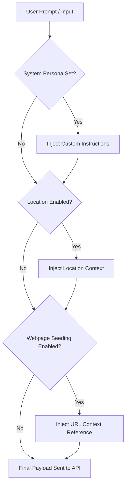

# SaaS RAG & Vision Agent Frontend 🚀

A premium, highly interactive React and Vite-based single-page application (SPA) that acts as the frontend interface for an enterprise RAG (Retrieval-Augmented Generation) & Multimodal Vision Agent. It features beautiful dark-themed aesthetics, dynamic session management, automated web knowledge seeding, file ingestion, location-aware prompts, and real-time backend metrics monitoring.

---

## 📂 Project Architecture

Here is an overview of the key files and directory structure:

```
frontend/
├── 📄 .env.example          # Template for backend base API endpoint configurations
├── 📄 index.html            # Main HTML entrypoint loading the React application
├── 📄 package.json          # React, Vite, and dependency definitions
├── 📄 vite.config.js        # Vite build configurations with automated backend API proxies
└── 📁 src/
    ├── 📄 main.jsx          # Application bootstrapper initializing React strict mode
    ├── 📄 api.js            # Standardized client API functions using native fetch calls
    ├── 📄 App.jsx           # Core application UI, State Management, and Markdown engine
    └── 📄 styles.css        # Premium custom CSS tokens, layouts, animations, and transitions
```

---

## ⚡ Core Features

*   **🔒 Secure Identity & Workspaces**: Dynamic registration and login modules caching identity tokens in LocalStorage for persistent workspace recovery.
*   **💬 Responsive Conversational Feed**: An ultra-clean chat viewport with starter prompts, auto-resizing textareas, message-level execution timelines, and responsive sidebar drawers.
*   **🛠️ RAG Insights & Latency Tracking**: Visual indicators highlighting confidence levels, source coverage stats, citation references, backend latency metrics, and automated suggested follow-up questions.
*   **📑 Multi-format File Ingestion**: Ingest PDF documents (encoded as Base64) or plain text/Markdown files, instantly converting them into accessible backend knowledge.
*   **👁️ Multimodal Computer Vision**: Attach and stream image data to the backend vision pipeline with customizable parameters for sensitive data validation and query execution.
*   **🌐 Automated Web Knowledge Seeding**: Sync web pages dynamically by typing or pasting a URL. The system scrapes, segments, processes, and lists sync metrics directly on the sidebar.
*   **📍 Location-Aware Contextualization**: Option to automatically attach the user's coordinate geometry or manual region settings to RAG inquiries for local search optimization.
*   **🎨 Premium Typography & Fluid UI**: High-contrast, meticulously designed visual elements with animations, modern fonts (`Inter`, `JetBrains Mono`), glassmorphic panels, and custom layouts.

---

## ⚙️ Prerequisites & Setup

Ensure you have [Node.js](https://nodejs.org/) (v18 or higher) installed on your system.

### 1. Install Dependencies
Initialize package dependencies:
```bash
npm install
```

### 2. Configure Environment Variables
Copy `.env.example` to `.env` and set the path to your RAG backend server:
```bash
cp .env.example .env
```
Default configuration contents:
```env
VITE_API_BASE_URL=http://127.0.0.1:8000
```

### 3. Start the Backend (required)

The Vite dev server proxies API calls to `http://127.0.0.1:8000`. Start the backend **before** (or in a separate terminal from) the frontend, or you will see `ECONNREFUSED` proxy errors.

```powershell
cd C:\Users\kulde\Desktop\AI\frontend
npm run dev:backend
```

Or from the repo root venv:

```powershell
cd C:\Users\kulde\Desktop\AI
.\.venv\Scripts\activate
cd backend
python app.py
```

Wait until you see `Application startup complete` in the backend terminal.

### 4. Run Development Server

Fire up the Vite local server (in another terminal):

```bash
npm run dev
```

The application will be accessible at [http://localhost:5173](http://localhost:5173).

---

## 🔌 API Endpoints & Proxy Configuration

The development server includes a built-in proxy layer in `vite.config.js` to bypass CORS issues when communicating with the RAG backend running on `http://127.0.0.1:8000`. The mapped endpoints include:

*   `POST /auth/login` - Provision workspace identities and JWT tokens
*   `POST /query` - Deliver RAG questions with custom headers for speed and response format
*   `GET /dashboard` - Fetch analytical and system operational data
*   `GET /health` - Fetch core service status maps (database, redis, LLM, MCP status)
*   `POST /input` - Ingest text, markdown, or PDF files into vector databases
*   `POST /knowledge/web/seed` - Crawl and digest online links into workspace knowledge
*   `GET /knowledge/web/list` - Fetch a detailed list of all ingested URL sites and text chunks
*   `POST /vision` - Submit computer vision questions along with image data in base64 format

---

## 🛡️ RAG Context Pipeline

When you submit queries, they are automatically enriched using configured dashboard settings:


